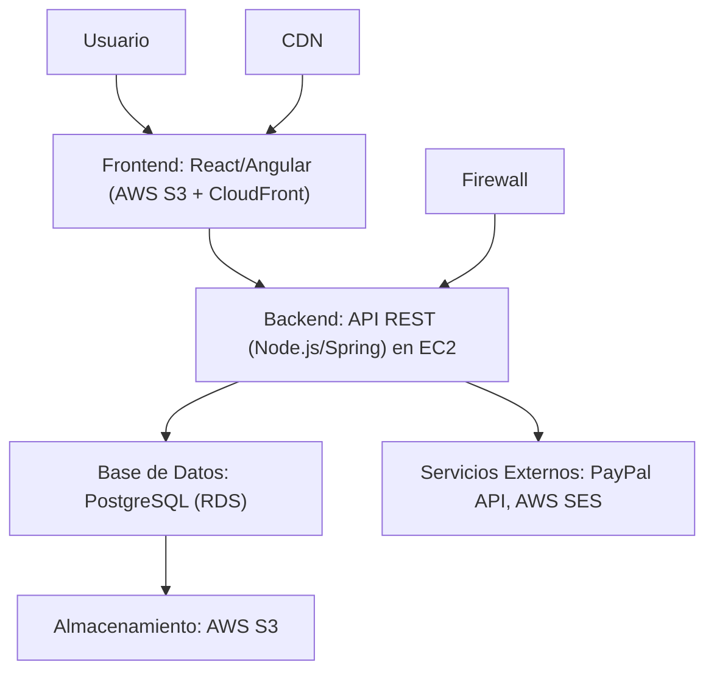

```mermaid
graph TD
    A[Usuario] --> B["Frontend: React/Angular (AWS S3 + CloudFront)"]
    B --> C["Backend: API REST (Node.js/Spring) en EC2"]
    C --> D["Base de Datos: PostgreSQL (RDS)"]
    C --> E["Servicios Externos: PayPal API, AWS SES"]
    D --> F["Almacenamiento: AWS S3"]
    G[Firewall] --> C
    H[CDN] --> B
```