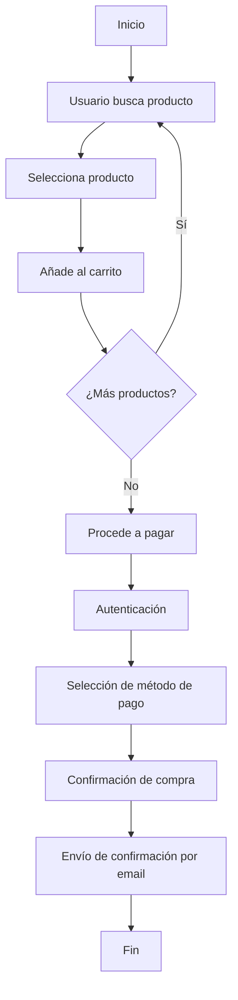

```mermaid
graph TB
    A[Inicio] --> B[Usuario busca producto]
    B --> C[Selecciona producto]
    C --> D[Añade al carrito]
    D --> E{¿Más productos?}
    E -->|Sí| B
    E -->|No| F[Procede a pagar]
    F --> G[Autenticación]
    G --> H[Selección de método de pago]
    H --> I[Confirmación de compra]
    I --> J[Envío de confirmación por email]
    J --> K[Fin]
```