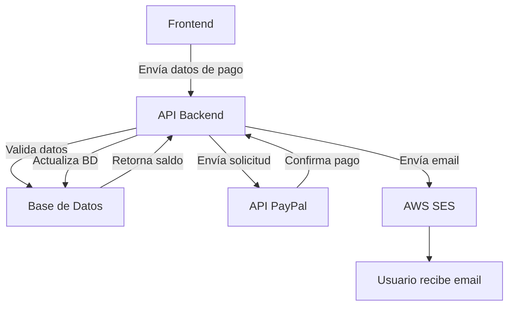

```mermaid
graph TD
    A[Frontend] -->|Envía datos de pago| B[API Backend]
    B -->|Valida datos| C[Base de Datos]
    C -->|Retorna saldo| B
    B -->|Envía solicitud| D[API PayPal]
    D -->|Confirma pago| B
    B -->|Envía email| E[AWS SES]
    B -->|Actualiza BD| C
    E --> F[Usuario recibe email]
```